# General

Train datasets: [December25_Chicken](https://huggingface.co/datasets/VibroNav/December25_Chicken) + [December25_Zucchini](https://huggingface.co/datasets/VibroNav/December25_Zucchini)

For later testing on 2-layer phantom dataset: [December25_ChickenZucchini](https://huggingface.co/datasets/VibroNav/December25_ChickenZucchini) + [December25_ZucchiniChicken](https://huggingface.co/datasets/VibroNav/December25_ZucchiniChicken)

## Purposes:
1. How different level of attenuations affect model results
2. How shaft augmentation affect model results when testing on same data but with attenuations

## Further research could involve:
1. Shaft augmentations and model tested on 2-layer phantoms.

# Results when validation on training dataset

## F1-Score

**No Shaft Augmentation**
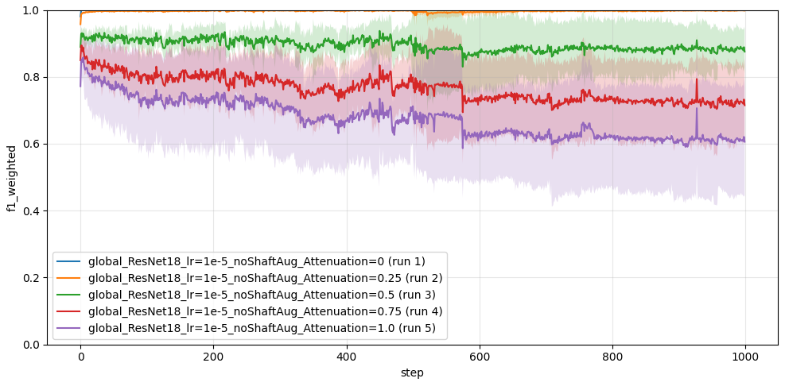

**Shaft Augmentation**
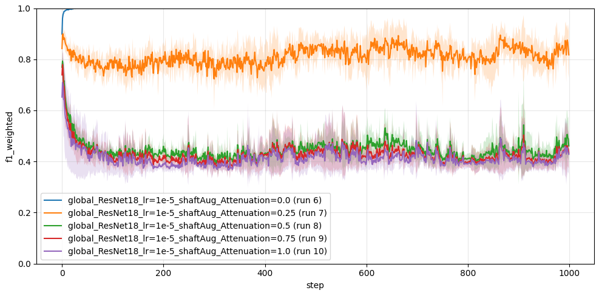

## Training loss

**No Shaft Augmentation**
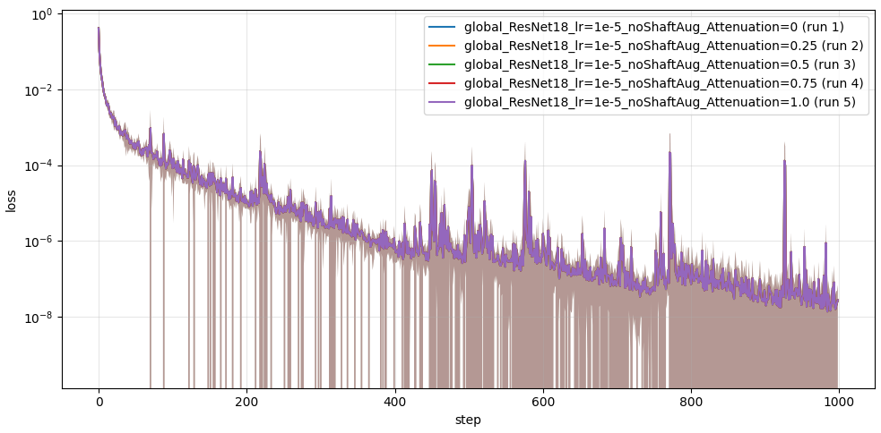

**Shaft Augmentation**
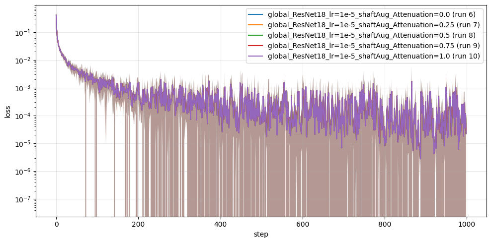

## Validation loss

**No Shaft Augmentation**
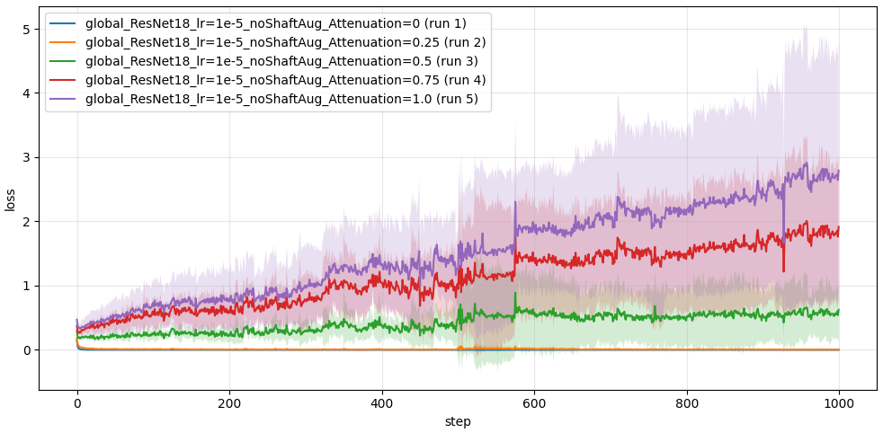

**Shaft Augmentation**
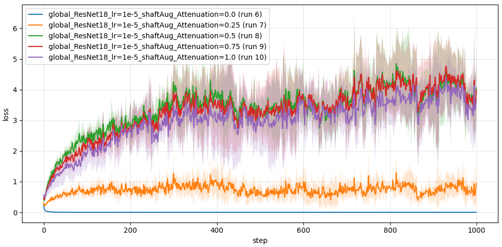

## Validation loss (log-scale)

**No Shaft Augmentation**
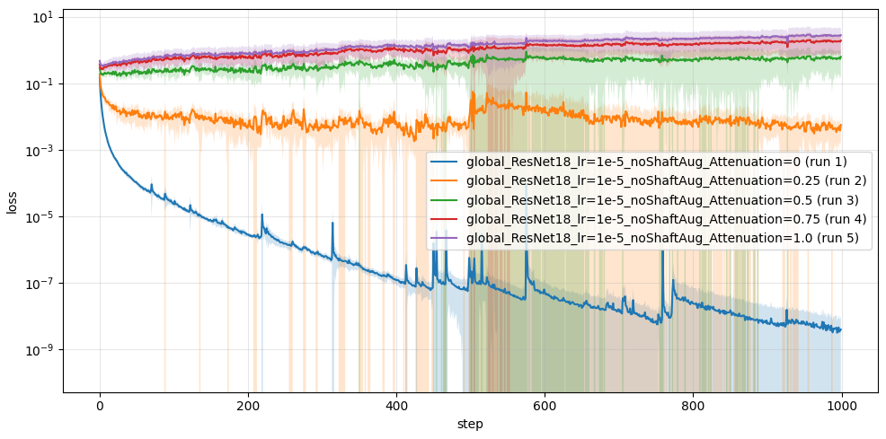

**Shaft Augmentation**
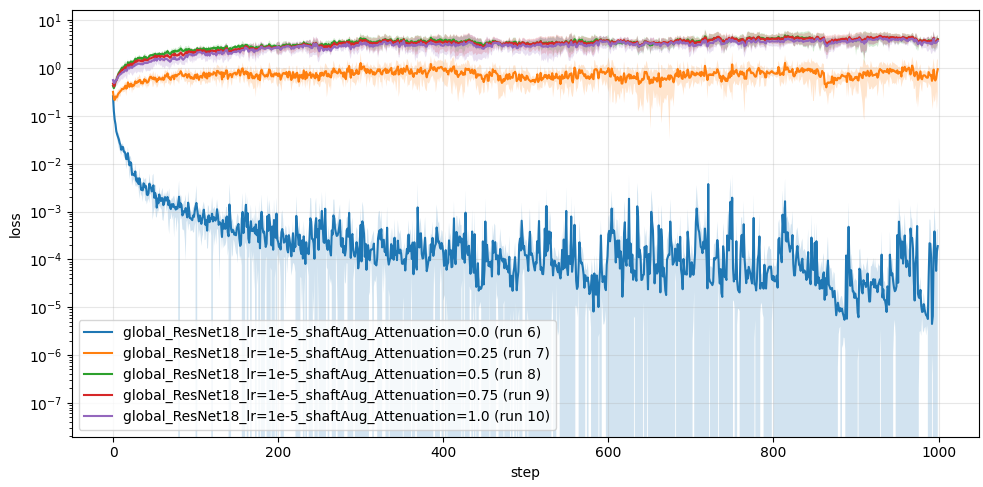

# Results when validating on 2-layer phantom (shaftAug vs no shaftAug)

**Some runs are taken from VNAV-374. It is noted on plots.**

## F1-Score

**Testing on CH-Z - compared when augmented and not augmented**
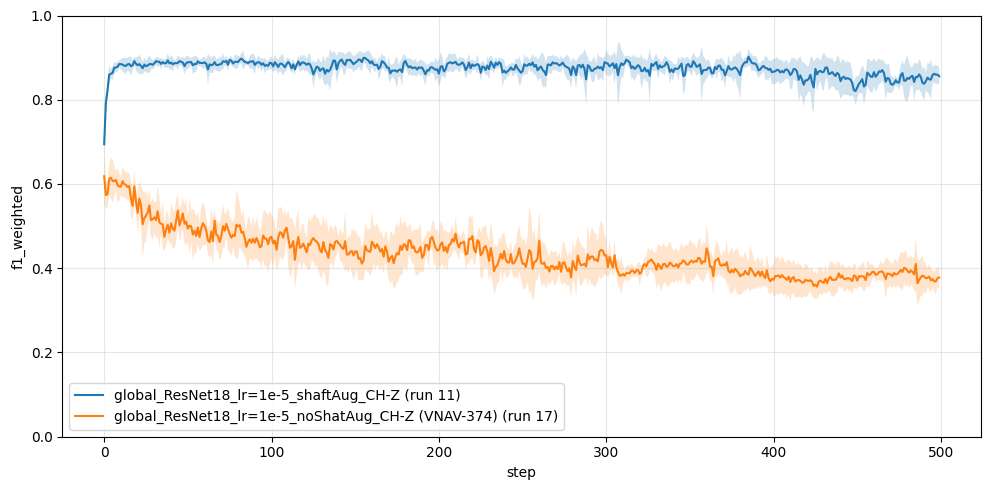

**Testing on Z-CH - compared when augmented and not augmented**
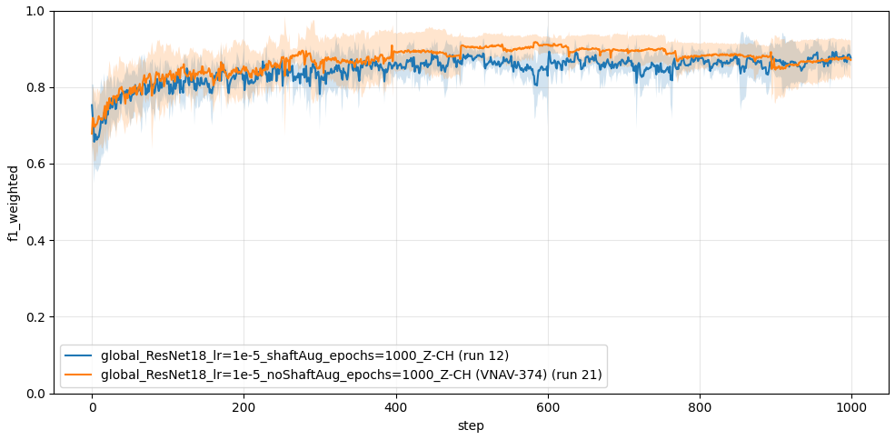

## Train loss

**Testing on CH-Z - compared when augmented and not augmented**
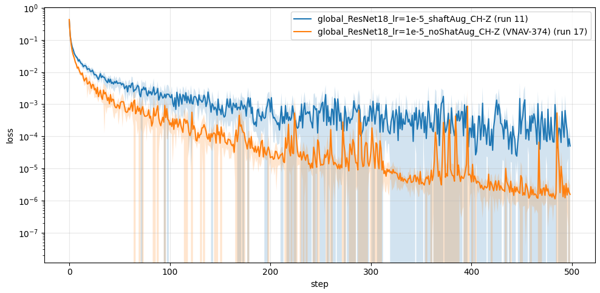

**Testing on Z-CH - compared when augmented and not augmented**
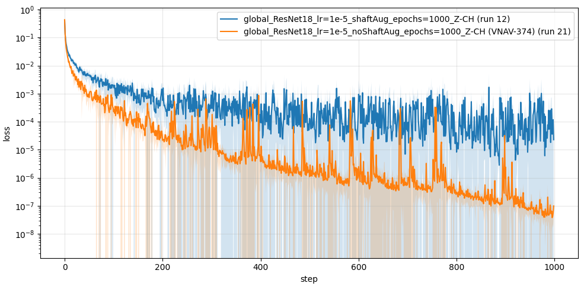

## Validation loss

**Testing on CH-Z - compared when augmented and not augmented**
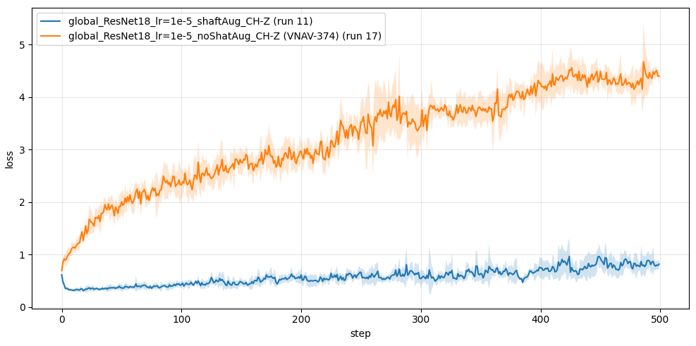

**Testing on Z-CH - compared when augmented and not augmented**
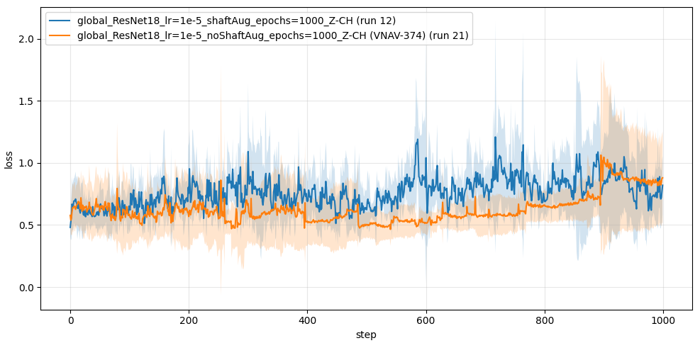

# Results when validating on 2-layer phantom (ResNet18 vs ResNet50)

## F1-Score

**Testing on CH-Z - compared ResNet18 vs ResNet50**
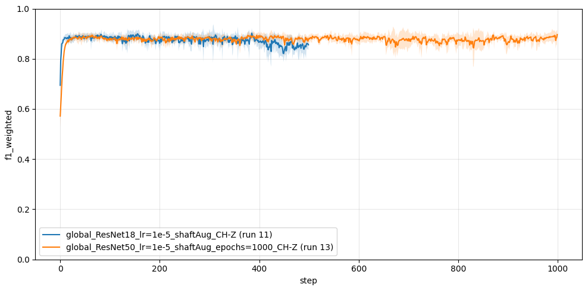

**Testing on Z-CH - compared ResNet18 vs ResNet50**
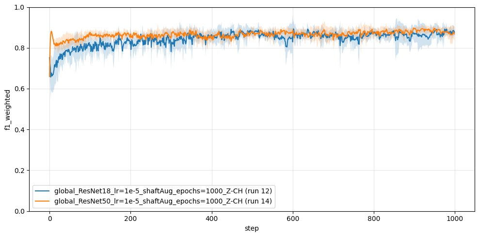

# Train loss

**Testing on CH-Z - compared ResNet18 vs ResNet50**
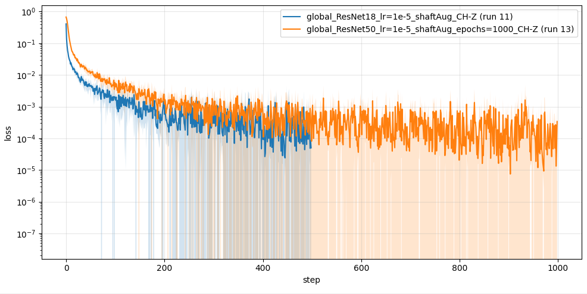

**Testing on Z-CH - compared ResNet18 vs ResNet50**
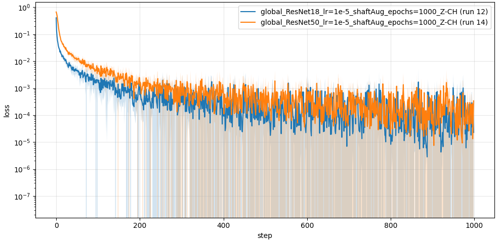

# Validation loss

**Testing on CH-Z - compared ResNet18 vs ResNet50**
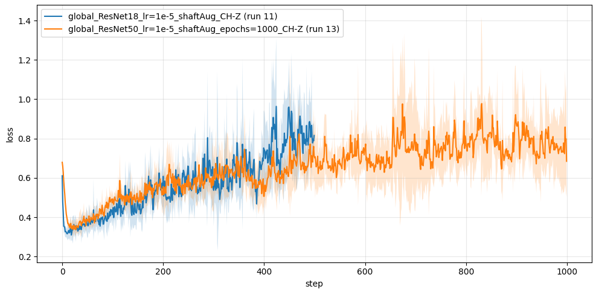

**Testing on Z-CH - compared ResNet18 vs ResNet50**
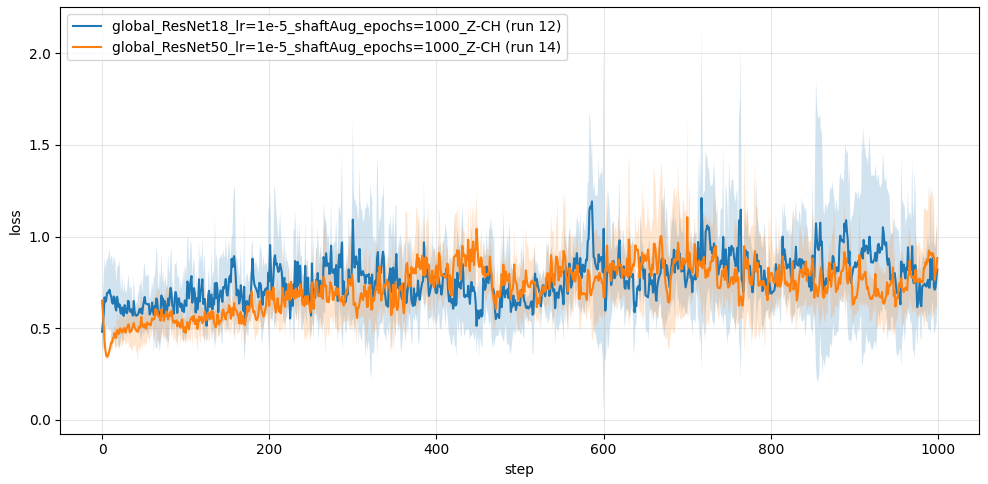

# Results of ResNet50 CH-Z vs Z-CH

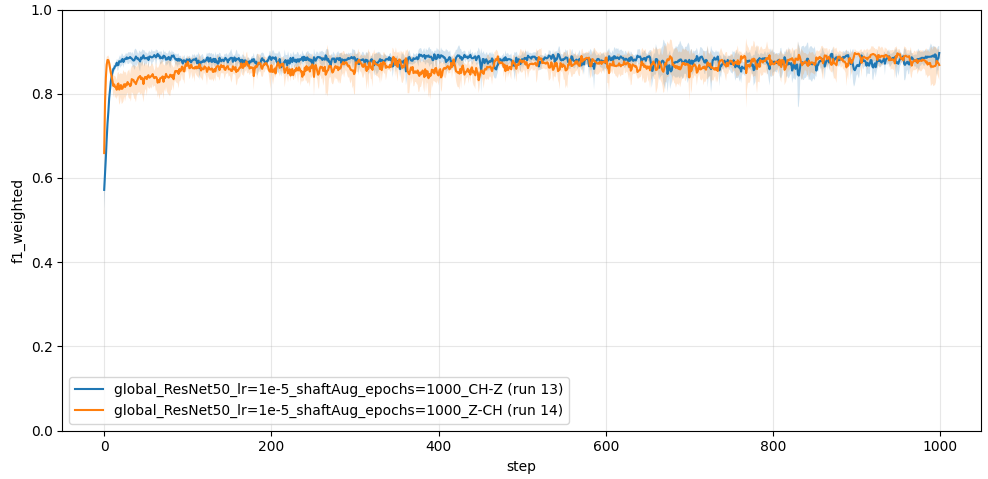


# Runs config

## Run 1
<details>
    <summary>Show configuration</summary>

```yaml
cfg:
  data:
    attenuation_level: 0.0
    augment_test: false
    augment_train: false
    augment_valid: false
    hop_length: 32
    labels_to_augment:
    - Chicken
    - Zucchini
    max_db: 80
    max_freq: 24000
    min_freq: 0
    n_ffts:
    - 512
    - 1024
    - 2048
    n_mels: 50
    name: cnnSpectrogram
    normalizing_method: global
    power: 2
    root: needlenet/data
    spectrogram_normalized: false
    spectrogram_type: mel
    target_sr: 48000
  description: null
  logs_dir: runs
  metrics:
    list:
    - name: accuracy
    - average: macro
      name: f1
    - average: weighted
      name: f1
    - average: none
      name: precision
    - average: none
      name: recall
  model:
    name: cnnResnet18
    pretrained: true
  relevance:
    top_k: 0.5
  run_suffix: '1_1'
  seed: 2
  training:
    batch_size: 64
    early_stop_patience: 1500
    loss: cross_entropy
    lr: 1.0e-05
    max_epochs: 1000
    min_lr: 1.0e-05
    monitor: val/f1_macro
    monitor_mode: max
    num_workers: 8
    optimizer: adamw
    scheduler: cosineannealinglr
idx_to_label:
  0: Chicken
  1: Zucchini
label_names:
- Chicken
- Zucchini
train_dataset_name: December25_Manual_CH_100ms_0.25_AND_December25_Manual_Z_100ms_0.25
valid_dataset_name: December25_Manual_CH_100ms_0.25_AND_December25_Manual_Z_100ms_0.25

```
</details>

## Run 2
<details>
    <summary>Show configuration</summary>

```yaml
cfg:
  data:
    attenuation_level: 0.25
    augment_test: false
    augment_train: false
    augment_valid: true
    hop_length: 32
    labels_to_augment:
    - Chicken
    - Zucchini
    max_db: 80
    max_freq: 24000
    min_freq: 0
    n_ffts:
    - 512
    - 1024
    - 2048
    n_mels: 50
    name: cnnSpectrogram
    normalizing_method: global
    power: 2
    root: needlenet/data
    spectrogram_normalized: false
    spectrogram_type: mel
    target_sr: 48000
  description: null
  logs_dir: runs
  metrics:
    list:
    - name: accuracy
    - average: macro
      name: f1
    - average: weighted
      name: f1
    - average: none
      name: precision
    - average: none
      name: recall
  model:
    name: cnnResnet18
    pretrained: true
  relevance:
    top_k: 0.5
  run_suffix: '2_1'
  seed: 2
  training:
    batch_size: 64
    early_stop_patience: 1500
    loss: cross_entropy
    lr: 1.0e-05
    max_epochs: 1000
    min_lr: 1.0e-05
    monitor: val/f1_macro
    monitor_mode: max
    num_workers: 8
    optimizer: adamw
    scheduler: cosineannealinglr
idx_to_label:
  0: Chicken
  1: Zucchini
label_names:
- Chicken
- Zucchini
train_dataset_name: December25_Manual_CH_100ms_0.25_AND_December25_Manual_Z_100ms_0.25
valid_dataset_name: December25_Manual_CH_100ms_0.25_AND_December25_Manual_Z_100ms_0.25

```
</details>

## Run 3
<details>
    <summary>Show configuration</summary>

```yaml
cfg:
  data:
    attenuation_level: 0.5
    augment_test: false
    augment_train: false
    augment_valid: true
    hop_length: 32
    labels_to_augment:
    - Chicken
    - Zucchini
    max_db: 80
    max_freq: 24000
    min_freq: 0
    n_ffts:
    - 512
    - 1024
    - 2048
    n_mels: 50
    name: cnnSpectrogram
    normalizing_method: global
    power: 2
    root: needlenet/data
    spectrogram_normalized: false
    spectrogram_type: mel
    target_sr: 48000
  description: null
  logs_dir: runs
  metrics:
    list:
    - name: accuracy
    - average: macro
      name: f1
    - average: weighted
      name: f1
    - average: none
      name: precision
    - average: none
      name: recall
  model:
    name: cnnResnet18
    pretrained: true
  relevance:
    top_k: 0.5
  run_suffix: '3_1'
  seed: 2
  training:
    batch_size: 64
    early_stop_patience: 1500
    loss: cross_entropy
    lr: 1.0e-05
    max_epochs: 1000
    min_lr: 1.0e-05
    monitor: val/f1_macro
    monitor_mode: max
    num_workers: 8
    optimizer: adamw
    scheduler: cosineannealinglr
idx_to_label:
  0: Chicken
  1: Zucchini
label_names:
- Chicken
- Zucchini
train_dataset_name: December25_Manual_CH_100ms_0.25_AND_December25_Manual_Z_100ms_0.25
valid_dataset_name: December25_Manual_CH_100ms_0.25_AND_December25_Manual_Z_100ms_0.25

```
</details>

## Run 4
<details>
    <summary>Show configuration</summary>

```yaml
cfg:
  data:
    attenuation_level: 0.75
    augment_test: false
    augment_train: false
    augment_valid: true
    hop_length: 32
    labels_to_augment:
    - Chicken
    - Zucchini
    max_db: 80
    max_freq: 24000
    min_freq: 0
    n_ffts:
    - 512
    - 1024
    - 2048
    n_mels: 50
    name: cnnSpectrogram
    normalizing_method: global
    power: 2
    root: needlenet/data
    spectrogram_normalized: false
    spectrogram_type: mel
    target_sr: 48000
  description: null
  logs_dir: runs
  metrics:
    list:
    - name: accuracy
    - average: macro
      name: f1
    - average: weighted
      name: f1
    - average: none
      name: precision
    - average: none
      name: recall
  model:
    name: cnnResnet18
    pretrained: true
  relevance:
    top_k: 0.5
  run_suffix: '4_1'
  seed: 2
  training:
    batch_size: 64
    early_stop_patience: 1500
    loss: cross_entropy
    lr: 1.0e-05
    max_epochs: 1000
    min_lr: 1.0e-05
    monitor: val/f1_macro
    monitor_mode: max
    num_workers: 8
    optimizer: adamw
    scheduler: cosineannealinglr
idx_to_label:
  0: Chicken
  1: Zucchini
label_names:
- Chicken
- Zucchini
train_dataset_name: December25_Manual_CH_100ms_0.25_AND_December25_Manual_Z_100ms_0.25
valid_dataset_name: December25_Manual_CH_100ms_0.25_AND_December25_Manual_Z_100ms_0.25

```
</details>

## Run 5
<details>
    <summary>Show configuration</summary>

```yaml
cfg:
  data:
    attenuation_level: 1.0
    augment_test: false
    augment_train: false
    augment_valid: true
    hop_length: 32
    labels_to_augment:
    - Chicken
    - Zucchini
    max_db: 80
    max_freq: 24000
    min_freq: 0
    n_ffts:
    - 512
    - 1024
    - 2048
    n_mels: 50
    name: cnnSpectrogram
    normalizing_method: global
    power: 2
    root: needlenet/data
    spectrogram_normalized: false
    spectrogram_type: mel
    target_sr: 48000
  description: null
  logs_dir: runs
  metrics:
    list:
    - name: accuracy
    - average: macro
      name: f1
    - average: weighted
      name: f1
    - average: none
      name: precision
    - average: none
      name: recall
  model:
    name: cnnResnet18
    pretrained: true
  relevance:
    top_k: 0.5
  run_suffix: '5_1'
  seed: 2
  training:
    batch_size: 64
    early_stop_patience: 1500
    loss: cross_entropy
    lr: 1.0e-05
    max_epochs: 1000
    min_lr: 1.0e-05
    monitor: val/f1_macro
    monitor_mode: max
    num_workers: 8
    optimizer: adamw
    scheduler: cosineannealinglr
idx_to_label:
  0: Chicken
  1: Zucchini
label_names:
- Chicken
- Zucchini
train_dataset_name: December25_Manual_CH_100ms_0.25_AND_December25_Manual_Z_100ms_0.25
valid_dataset_name: December25_Manual_CH_100ms_0.25_AND_December25_Manual_Z_100ms_0.25

```
</details>

## Run 6
<details>
    <summary>Show configuration</summary>

```yaml
cfg:
  data:
    attenuation_level: 0.0
    augment_test: false
    augment_train: true
    augment_valid: false
    hop_length: 32
    labels_to_augment:
    - Chicken
    - Zucchini
    max_db: 80
    max_freq: 24000
    min_freq: 0
    n_ffts:
    - 512
    - 1024
    - 2048
    n_mels: 50
    name: cnnSpectrogram
    normalizing_method: global
    power: 2
    root: needlenet/data
    spectrogram_normalized: false
    spectrogram_type: mel
    target_sr: 48000
  description: null
  logs_dir: runs
  metrics:
    list:
    - name: accuracy
    - average: macro
      name: f1
    - average: weighted
      name: f1
    - average: none
      name: precision
    - average: none
      name: recall
  model:
    name: cnnResnet18
    pretrained: true
  relevance:
    top_k: 0.5
  run_suffix: '6_1'
  seed: 2
  training:
    batch_size: 64
    early_stop_patience: 1500
    loss: cross_entropy
    lr: 1.0e-05
    max_epochs: 1000
    min_lr: 1.0e-05
    monitor: val/f1_macro
    monitor_mode: max
    num_workers: 8
    optimizer: adamw
    scheduler: cosineannealinglr
idx_to_label:
  0: Chicken
  1: Zucchini
label_names:
- Chicken
- Zucchini
train_dataset_name: December25_Manual_CH_100ms_0.25_AND_December25_Manual_Z_100ms_0.25
valid_dataset_name: December25_Manual_CH_100ms_0.25_AND_December25_Manual_Z_100ms_0.25

```
</details>

## Run 7
<details>
    <summary>Show configuration</summary>

```yaml
cfg:
  data:
    attenuation_level: 0.25
    augment_test: false
    augment_train: true
    augment_valid: true
    hop_length: 32
    labels_to_augment:
    - Chicken
    - Zucchini
    max_db: 80
    max_freq: 24000
    min_freq: 0
    n_ffts:
    - 512
    - 1024
    - 2048
    n_mels: 50
    name: cnnSpectrogram
    normalizing_method: global
    power: 2
    root: needlenet/data
    spectrogram_normalized: false
    spectrogram_type: mel
    target_sr: 48000
  description: null
  logs_dir: runs
  metrics:
    list:
    - name: accuracy
    - average: macro
      name: f1
    - average: weighted
      name: f1
    - average: none
      name: precision
    - average: none
      name: recall
  model:
    name: cnnResnet18
    pretrained: true
  relevance:
    top_k: 0.5
  run_suffix: '7_1'
  seed: 2
  training:
    batch_size: 64
    early_stop_patience: 1500
    loss: cross_entropy
    lr: 1.0e-05
    max_epochs: 1000
    min_lr: 1.0e-05
    monitor: val/f1_macro
    monitor_mode: max
    num_workers: 8
    optimizer: adamw
    scheduler: cosineannealinglr
idx_to_label:
  0: Chicken
  1: Zucchini
label_names:
- Chicken
- Zucchini
train_dataset_name: December25_Manual_CH_100ms_0.25_AND_December25_Manual_Z_100ms_0.25
valid_dataset_name: December25_Manual_CH_100ms_0.25_AND_December25_Manual_Z_100ms_0.25

```
</details>

## Run 8
<details>
    <summary>Show configuration</summary>

```yaml
cfg:
  data:
    attenuation_level: 0.5
    augment_test: false
    augment_train: true
    augment_valid: true
    hop_length: 32
    labels_to_augment:
    - Chicken
    - Zucchini
    max_db: 80
    max_freq: 24000
    min_freq: 0
    n_ffts:
    - 512
    - 1024
    - 2048
    n_mels: 50
    name: cnnSpectrogram
    normalizing_method: global
    power: 2
    root: needlenet/data
    spectrogram_normalized: false
    spectrogram_type: mel
    target_sr: 48000
  description: null
  logs_dir: runs
  metrics:
    list:
    - name: accuracy
    - average: macro
      name: f1
    - average: weighted
      name: f1
    - average: none
      name: precision
    - average: none
      name: recall
  model:
    name: cnnResnet18
    pretrained: true
  relevance:
    top_k: 0.5
  run_suffix: '8_1'
  seed: 2
  training:
    batch_size: 64
    early_stop_patience: 1500
    loss: cross_entropy
    lr: 1.0e-05
    max_epochs: 1000
    min_lr: 1.0e-05
    monitor: val/f1_macro
    monitor_mode: max
    num_workers: 8
    optimizer: adamw
    scheduler: cosineannealinglr
idx_to_label:
  0: Chicken
  1: Zucchini
label_names:
- Chicken
- Zucchini
train_dataset_name: December25_Manual_CH_100ms_0.25_AND_December25_Manual_Z_100ms_0.25
valid_dataset_name: December25_Manual_CH_100ms_0.25_AND_December25_Manual_Z_100ms_0.25

```
</details>

## Run 9
<details>
    <summary>Show configuration</summary>

```yaml
cfg:
  data:
    attenuation_level: 0.75
    augment_test: false
    augment_train: true
    augment_valid: true
    hop_length: 32
    labels_to_augment:
    - Chicken
    - Zucchini
    max_db: 80
    max_freq: 24000
    min_freq: 0
    n_ffts:
    - 512
    - 1024
    - 2048
    n_mels: 50
    name: cnnSpectrogram
    normalizing_method: global
    power: 2
    root: needlenet/data
    spectrogram_normalized: false
    spectrogram_type: mel
    target_sr: 48000
  description: null
  logs_dir: runs
  metrics:
    list:
    - name: accuracy
    - average: macro
      name: f1
    - average: weighted
      name: f1
    - average: none
      name: precision
    - average: none
      name: recall
  model:
    name: cnnResnet18
    pretrained: true
  relevance:
    top_k: 0.5
  run_suffix: '9_1'
  seed: 2
  training:
    batch_size: 64
    early_stop_patience: 1500
    loss: cross_entropy
    lr: 1.0e-05
    max_epochs: 1000
    min_lr: 1.0e-05
    monitor: val/f1_macro
    monitor_mode: max
    num_workers: 8
    optimizer: adamw
    scheduler: cosineannealinglr
idx_to_label:
  0: Chicken
  1: Zucchini
label_names:
- Chicken
- Zucchini
train_dataset_name: December25_Manual_CH_100ms_0.25_AND_December25_Manual_Z_100ms_0.25
valid_dataset_name: December25_Manual_CH_100ms_0.25_AND_December25_Manual_Z_100ms_0.25

```
</details>

## Run 10
<details>
    <summary>Show configuration</summary>

```yaml
cfg:
  data:
    attenuation_level: 1.0
    augment_test: false
    augment_train: true
    augment_valid: true
    hop_length: 32
    labels_to_augment:
    - Chicken
    - Zucchini
    max_db: 80
    max_freq: 24000
    min_freq: 0
    n_ffts:
    - 512
    - 1024
    - 2048
    n_mels: 50
    name: cnnSpectrogram
    normalizing_method: global
    power: 2
    root: needlenet/data
    spectrogram_normalized: false
    spectrogram_type: mel
    target_sr: 48000
  description: null
  logs_dir: runs
  metrics:
    list:
    - name: accuracy
    - average: macro
      name: f1
    - average: weighted
      name: f1
    - average: none
      name: precision
    - average: none
      name: recall
  model:
    name: cnnResnet18
    pretrained: true
  relevance:
    top_k: 0.5
  run_suffix: '10_1'
  seed: 2
  training:
    batch_size: 64
    early_stop_patience: 1500
    loss: cross_entropy
    lr: 1.0e-05
    max_epochs: 1000
    min_lr: 1.0e-05
    monitor: val/f1_macro
    monitor_mode: max
    num_workers: 8
    optimizer: adamw
    scheduler: cosineannealinglr
idx_to_label:
  0: Chicken
  1: Zucchini
label_names:
- Chicken
- Zucchini
train_dataset_name: December25_Manual_CH_100ms_0.25_AND_December25_Manual_Z_100ms_0.25
valid_dataset_name: December25_Manual_CH_100ms_0.25_AND_December25_Manual_Z_100ms_0.25

```
</details>

## Run 11
<details>
    <summary>Show configuration</summary>

```yaml
cfg:
  data:
    attenuation_level: 0.0
    augment_test: false
    augment_train: true
    augment_valid: false
    hop_length: 32
    labels_to_augment:
    - Chicken
    - Zucchini
    max_db: 80
    max_freq: 24000
    min_freq: 0
    n_ffts:
    - 512
    - 1024
    - 2048
    n_mels: 50
    name: cnnSpectrogram
    normalizing_method: global
    power: 2
    root: needlenet/data
    spectrogram_normalized: false
    spectrogram_type: mel
    target_sr: 48000
  description: null
  logs_dir: runs
  metrics:
    list:
    - name: accuracy
    - average: macro
      name: f1
    - average: weighted
      name: f1
    - average: none
      name: precision
    - average: none
      name: recall
  model:
    name: cnnResnet18
    pretrained: true
  relevance:
    top_k: 0.5
  run_suffix: '11_1'
  seed: 2
  training:
    batch_size: 64
    early_stop_patience: 1000
    loss: cross_entropy
    lr: 1.0e-05
    max_epochs: 500
    min_lr: 1.0e-05
    monitor: val/f1_macro
    monitor_mode: max
    num_workers: 8
    optimizer: adamw
    scheduler: cosineannealinglr
idx_to_label:
  0: Chicken
  1: Zucchini
label_names:
- Chicken
- Zucchini
train_dataset_name: December25_Manual_CH_100ms_0.25_AND_December25_Manual_Z_100ms_0.25
valid_dataset_name: December25_Manual_CH-Z_100ms_0.25

```
</details>

## Run 12
<details>
    <summary>Show configuration</summary>

```yaml
cfg:
  data:
    attenuation_level: 0.0
    augment_test: false
    augment_train: true
    augment_valid: false
    hop_length: 32
    labels_to_augment:
    - Chicken
    - Zucchini
    max_db: 80
    max_freq: 24000
    min_freq: 0
    n_ffts:
    - 512
    - 1024
    - 2048
    n_mels: 50
    name: cnnSpectrogram
    normalizing_method: global
    power: 2
    root: needlenet/data
    spectrogram_normalized: false
    spectrogram_type: mel
    target_sr: 48000
  description: null
  logs_dir: runs
  metrics:
    list:
    - name: accuracy
    - average: macro
      name: f1
    - average: weighted
      name: f1
    - average: none
      name: precision
    - average: none
      name: recall
  model:
    name: cnnResnet18
    pretrained: true
  relevance:
    top_k: 0.5
  run_suffix: '12_1'
  seed: 2
  training:
    batch_size: 64
    early_stop_patience: 1500
    loss: cross_entropy
    lr: 1.0e-05
    max_epochs: 1000
    min_lr: 1.0e-05
    monitor: val/f1_macro
    monitor_mode: max
    num_workers: 8
    optimizer: adamw
    scheduler: cosineannealinglr
idx_to_label:
  0: Chicken
  1: Zucchini
label_names:
- Chicken
- Zucchini
train_dataset_name: December25_Manual_CH_100ms_0.25_AND_December25_Manual_Z_100ms_0.25
valid_dataset_name: December25_Manual_Z-CH_100ms_0.25

```
</details>

## Run 13
<details>
    <summary>Show configuration</summary>

```yaml
cfg:
  data:
    attenuation_level: 0.0
    augment_test: false
    augment_train: true
    augment_valid: false
    hop_length: 32
    labels_to_augment:
    - Chicken
    - Zucchini
    max_db: 80
    max_freq: 24000
    min_freq: 0
    n_ffts:
    - 512
    - 1024
    - 2048
    n_mels: 50
    name: cnnSpectrogram
    normalizing_method: global
    power: 2
    root: needlenet/data
    spectrogram_normalized: false
    spectrogram_type: mel
    target_sr: 48000
  description: null
  logs_dir: runs
  metrics:
    list:
    - name: accuracy
    - average: macro
      name: f1
    - average: weighted
      name: f1
    - average: none
      name: precision
    - average: none
      name: recall
  model:
    name: cnnResnet50
    pretrained: true
  relevance:
    top_k: 0.5
  run_suffix: '13_1'
  seed: 2
  training:
    batch_size: 64
    early_stop_patience: 1500
    loss: cross_entropy
    lr: 1.0e-05
    max_epochs: 1000
    min_lr: 1.0e-05
    monitor: val/f1_macro
    monitor_mode: max
    num_workers: 8
    optimizer: adamw
    scheduler: cosineannealinglr
idx_to_label:
  0: Chicken
  1: Zucchini
label_names:
- Chicken
- Zucchini
train_dataset_name: December25_Manual_CH_100ms_0.25_AND_December25_Manual_Z_100ms_0.25
valid_dataset_name: December25_Manual_CH-Z_100ms_0.25

```
</details>

## Run 14
<details>
    <summary>Show configuration</summary>

```yaml
cfg:
  data:
    attenuation_level: 0.0
    augment_test: false
    augment_train: true
    augment_valid: false
    hop_length: 32
    labels_to_augment:
    - Chicken
    - Zucchini
    max_db: 80
    max_freq: 24000
    min_freq: 0
    n_ffts:
    - 512
    - 1024
    - 2048
    n_mels: 50
    name: cnnSpectrogram
    normalizing_method: global
    power: 2
    root: needlenet/data
    spectrogram_normalized: false
    spectrogram_type: mel
    target_sr: 48000
  description: null
  logs_dir: runs
  metrics:
    list:
    - name: accuracy
    - average: macro
      name: f1
    - average: weighted
      name: f1
    - average: none
      name: precision
    - average: none
      name: recall
  model:
    name: cnnResnet50
    pretrained: true
  relevance:
    top_k: 0.5
  run_suffix: '14_1'
  seed: 2
  training:
    batch_size: 64
    early_stop_patience: 1500
    loss: cross_entropy
    lr: 1.0e-05
    max_epochs: 1000
    min_lr: 1.0e-05
    monitor: val/f1_macro
    monitor_mode: max
    num_workers: 8
    optimizer: adamw
    scheduler: cosineannealinglr
idx_to_label:
  0: Chicken
  1: Zucchini
label_names:
- Chicken
- Zucchini
train_dataset_name: December25_Manual_CH_100ms_0.25_AND_December25_Manual_Z_100ms_0.25
valid_dataset_name: December25_Manual_Z-CH_100ms_0.25

```
</details>